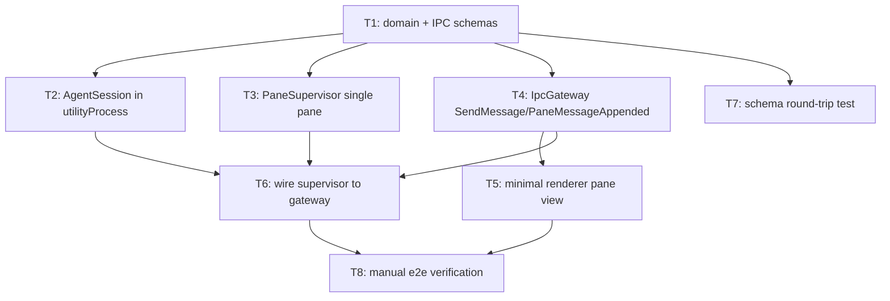

# Bullet 01 — Single-Pane Walking Skeleton

**Goal:** One pane spawns its own `utilityProcess`, runs a real Agent SDK session inside it via `AgentSession`, and exchanges messages with the renderer over the Effect-orchestrated IPC contract — proving the riskiest, least-proven part of the architecture (Agent SDK + Effect TS fiber/scope lifecycle inside a `utilityProcess`) works end-to-end before anything else is built on top of it.

**Serves these PRD items:**

- US-3: "As a user, I want each pane to run its own fully independent agent session so that one pane's conversation, working directory, and progress are unaffected by any other pane."
- US-4: "As a user, I want to set a different working directory and model for each pane so that I can work on different projects or different parts of a project at once."
- G-1: "Dogfooding milestone reached..." (partial — this bullet only proves the substrate the milestone depends on)

## Tasks

- [ ] **T1** [AFK] Define `Schema` types for `PaneConfig`, a minimal `PaneRecord` (config + history only), and the IPC message schemas for `SendMessage` / `PaneMessageAppended` (tech spec §3, §4.5) — serves: US-3, US-4 — depends: —
- [ ] **T2** [AFK] Implement `AgentSession` inside the `utilityProcess`: initializes the Agent SDK query loop with the pane's `cwd`/`model`, sends/receives messages over the process's IPC channel (§4.3) — serves: US-3, US-4 — depends: T1
- [ ] **T3** [AFK] Implement `PaneSupervisor` for a single pane: spawn the `utilityProcess` via `Effect.acquireRelease`, fork a `Fiber` consuming the process's message stream into a `Ref<PaneRecord>` (§4.2 steps 1–3, single pane only) — serves: US-3 — depends: T1
- [ ] **T4** [AFK] Implement `IpcGateway` encode/decode for the `SendMessage` command and `PaneMessageAppended` event, wired main ↔ renderer (§4.5) — serves: US-3 — depends: T1
- [ ] **T5** [AFK] Minimal renderer: single pane view, text input, message list rendered from IPC events — serves: US-3 — depends: T4
- [ ] **T6** [AFK] Wire `PaneSupervisor`'s consumed stream to `IpcGateway` publish (§4.2 step 4), connecting T2/T3 to T4/T5 — serves: US-3 — depends: T2, T3, T4
- [ ] **T7** [AFK] Automated test: `PaneConfig`/`PaneRecord` `Schema` encode/decode round-trip — serves: G-1 — depends: T1
- [ ] **T8** [HIL] Manual verification: launch the app, create one pane against a real project `cwd`, send a message, confirm a real local Claude Code session replies and renders correctly — serves: US-3, US-4 — depends: T5, T6

## Dependency tree

## Note on streaming plumbing

T5's renderer only renders complete `PaneMessageAppended` events (final assistant turns). As of the Effect conversion of `agent-session.ts` (ADR-0010), the IPC contract also carries `PaneAssistantTextDelta` events — one per streamed text chunk from the Agent SDK's `includePartialMessages` mode — but nothing in the renderer consumes them yet; they flow through and decode correctly and are otherwise dropped. Whichever future bullet/task adds token-by-token rendering to the message view should subscribe to `PaneAssistantTextDelta` (keyed by pane, accumulated until the matching `PaneMessageAppended` finalizes the turn) rather than adding a new event — the plumbing already exists end-to-end.

## Human-in-the-loop callouts

- **T8** — Only a human can drive a real Agent SDK conversation against a real local Claude Code installation and judge whether the reply is correct and the UX behaves as expected. This is blocked-on-info (the real behavior of the Agent SDK inside this new process architecture isn't known until observed) and cannot be decomposed further without losing the point of the verification.

## Done when

A single pane can be created with a chosen `cwd`/model, a message sent through it is answered by a real local Claude Code agent session running in its own `utilityProcess`, and the reply renders in the UI — demonstrating the full vertical slice (renderer → IPC → Effect orchestration → utilityProcess → Agent SDK → back) works.
