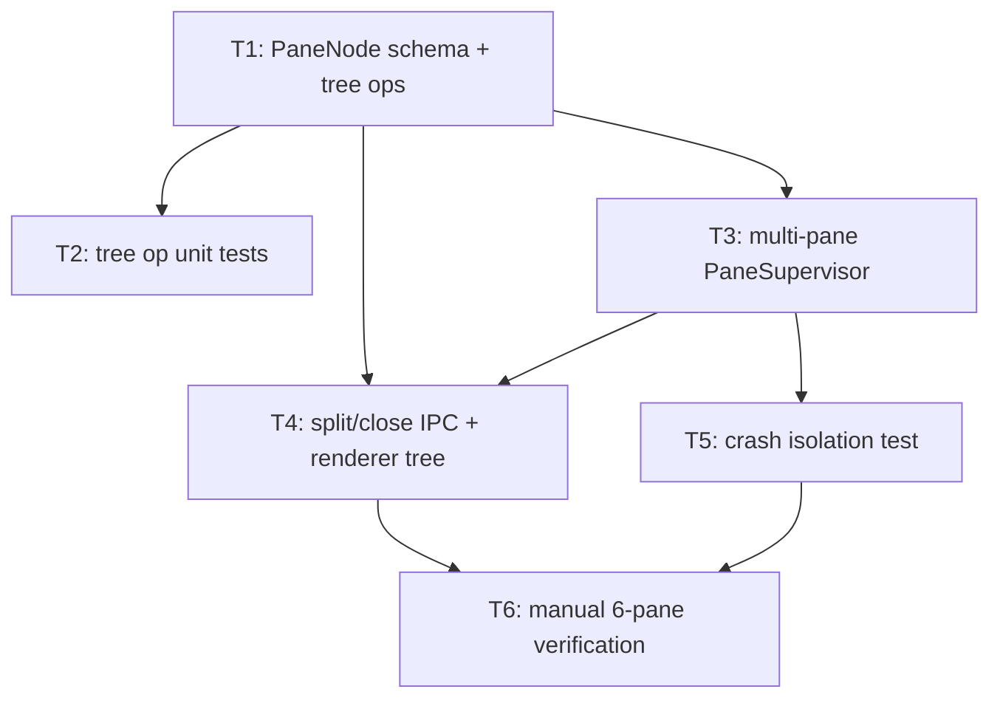

# Bullet 02 — Multi-Pane Split Layout

**Goal:** The single pane from Bullet 01 becomes a splittable tree — any pane can be split further, in either direction, any number of times — with each leaf running its own fully independent `PaneSupervisor`-managed session, scaling to at least 6 concurrent panes without perceptible lag.

**Serves these PRD items:**

- US-1: "As a user, I want to split my workspace into multiple panes so that I can run separate agent sessions in parallel, similar to tmux."
- US-2: "As a user, I want to split any pane further, in either direction, as many times as I need, so that my layout can adapt to however many parallel sessions I'm running at a given time."
- US-3: "...one pane's conversation, working directory, and progress are unaffected by any other pane." (verified at scale)
- G-2: "dia supports at least 6 concurrent independent panes running without perceptible input lag."

## Tasks

- [x] **T1** [AFK] Implement the `PaneNode` `Schema` type (`Split`/`Leaf`) and `PaneTreeService` pure tree operations: `split`, `close`, `resize` (§3, §4.1) — serves: US-1, US-2 — depends: —
- [x] **T2** [AFK] Automated unit tests for `split`/`close`/`resize` tree transforms, including nested/multi-directional splits — serves: US-1, US-2 — depends: T1
- [x] **T3** [AFK] Extend `PaneSupervisor` to manage N independent `Fiber`+`Scope` instances keyed by `paneId`, one per tree leaf, reusing Bullet 01's `AgentSession`/`utilityProcess` plumbing (§4.2, §5) — serves: US-3 — depends: T1
- [x] **T4** [AFK] Extend `IpcGateway` with `SplitPane`/`ClosePane` commands and a `LayoutChanged` event; render the `PaneNode` tree as resizable panes in the renderer — serves: US-1, US-2 — depends: T1, T3
- [x] **T5** [AFK] Automated test simulating a pane crash (`ProcessCrashedError`) via a test `Layer` in place of a real `utilityProcess`, confirming only that pane's `Scope` tears down and sibling panes are unaffected (ADR-0007 isolation guarantee) — serves: US-3 — depends: T3
- [x] **T6** [HIL] Manual verification: split to 6+ concurrent panes across real projects (including dia's own repo), confirm no perceptible input lag and that each pane's session stays fully independent — serves: US-1, US-2, US-3, G-2 — depends: T4, T5

## Dependency tree

## Human-in-the-loop callouts

- **T6** — "No perceptible input lag" is a subjective, felt judgment that only a human using the app can make; it cannot be reduced to an automated assertion without changing what's actually being validated (irreducible: judgment).

## Done when

A user can split the workspace into 6+ panes in any combination of directions, each running its own independent agent session against its own `cwd`, with no cross-pane interference and no perceptible lag under real use.
