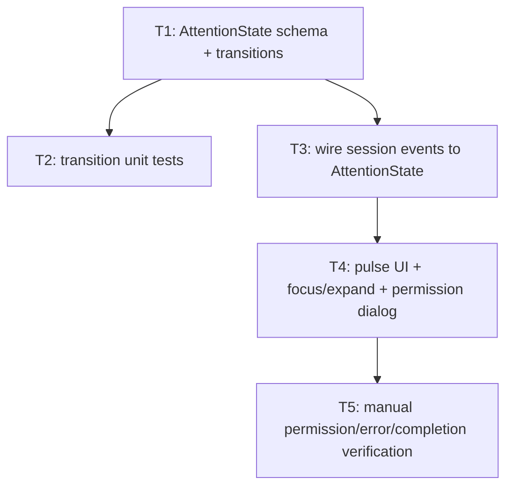

# Bullet 03 — Attention State & Pulse Indicators

**Goal:** Every pane's `AttentionState` (waiting on permission / errored / completed) drives a pulse indicator visible across the whole layout, and clicking a pulsing pane focuses/expands it so the user can act on it — the one deliberate loud signal in dia's design.

**Serves these PRD items:**

- US-5: "As a user, I want a pane to pulse amber when its agent is waiting on a permission decision so that I notice it without having to actively watch every pane."
- US-6: "As a user, I want a pane to pulse red on an error and green on completion so that I can tell each pane's status at a glance across the whole layout."
- US-7: "As a user, I want to click a pulsing pane to focus it and have it expand so that I can easily see its context and act on its permission dialog."
- G-4: "Every pane's attention state... is visually reflected via its pulse indicator with no missed or incorrect state observed during testing."

## Tasks

- [ ] **T1** [AFK] Implement the `AttentionState` `Schema` and pure transition logic: `Idle → AwaitingPermission → Idle`, `Idle → Errored`, `Idle → Completed → Idle` (§3) — serves: US-5, US-6 — depends: —
- [ ] **T2** [AFK] Automated tests for every valid `AttentionState` transition and rejection of invalid ones — serves: G-4 — depends: T1
- [ ] **T3** [AFK] Wire `AgentSession`/`PaneSupervisor` to emit `AttentionState` changes on permission-request/error/completion events and publish `PaneAttentionChanged` via `IpcGateway` (§4.2 step 4, §4.3, §6) — serves: US-5, US-6 — depends: T1
- [ ] **T4** [AFK] Renderer: pulse indicator component driven by `AttentionState` (amber/red/green), click-to-focus/expand behavior, and a `ResolvePermission` command wired to a permission dialog — serves: US-5, US-6, US-7 — depends: T3
- [ ] **T5** [HIL] Manual verification: trigger a real permission-required tool call and confirm amber pulse + focus/expand + dialog + approve/deny resolution all work; trigger a real error and a real completion and confirm red/green pulses appear correctly — serves: US-5, US-6, US-7, G-4 — depends: T4

## Dependency tree

## Note on existing plumbing

Some of the wiring T3/T4 need already exists, built ahead of this bullet while extending Effect TS into `agent-session.ts` (ADR-0010): `protocol.ts`/`contract.ts` carry `PermissionRequested`/`ResolvePermission` messages end-to-end, and `agent-session.ts` suspends `canUseTool` on an Effect `Deferred` until a `ResolvePermission` message resolves it. None of this is wired to an `AttentionState` yet (that schema doesn't exist) and there is no renderer UI — T1 (the `AttentionState` schema itself) and T4's actual dialog/pulse UI are still fully open. T3 can likely consume the existing `PermissionRequested` event rather than adding a new one.

## Human-in-the-loop callouts

- **T5** — Whether the pulse actually appears correctly, on time, and is missed or not can only be judged by watching a real permission prompt / error / completion happen against a real local Claude Code session; this is blocked-on-info (the SDK's real event timing/shape isn't fully known until observed) and is exactly what G-4 requires to be demonstrated by a human, not asserted.

## Done when

Across a multi-pane layout, a real permission request pulses its pane amber, a real error pulses red, a real completion pulses green, and clicking any pulsing pane focuses and expands it with its permission dialog actionable — with no missed or incorrect state observed.
