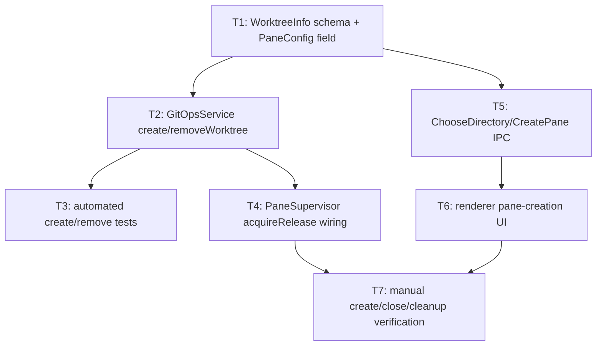

# Bullet 03 — Working Directory Picker & Worktree Management

**Goal:** Creating a pane offers a native directory picker for its `cwd` and an optional toggle to create an isolated git worktree for it; closing a pane that owns a worktree automatically removes it — with zero orphaned worktrees left behind.

**Serves these PRD items:**

- US-4: "As a user, I want to choose a pane's working directory via a directory picker and set its model when I create the pane so that I can work on different projects or different parts of a project at once."
- US-5: "As a user, I want the option to create an isolated git worktree for a pane when its working directory is a git repo so that the pane's changes stay isolated from my main working copy and from other panes working in the same repo."
- US-6: "As a user, I want a pane's worktree to be automatically cleaned up when I close that pane so that I don't have to remember to remove it myself or accumulate stale worktrees over time."
- G-5: "Across repeated pane create/close cycles during testing, closing a pane that owns a worktree leaves zero orphaned worktrees behind."

## Tasks

- [x] **T1** [AFK] Define `Schema` types for `WorktreeInfo` and extend `PaneConfig` with an optional `worktree` field (tech spec §3) — serves: US-4, US-5 — depends: —
- [x] **T2** [AFK] Implement `GitOpsService.createWorktree`/`.removeWorktree` via `@effect/platform`'s `Command` executor (`git worktree add`/`remove`), returning typed `WorktreeCreateError`/`WorktreeRemoveError` (§4.6). Named `GitOpsService` rather than a worktree-only service since more git operations are expected in later bullets — serves: US-5, US-6 — depends: T1
- [x] **T3** [AFK] Automated tests for `GitOpsService` against a test `Layer` in place of the real git executor: successful create/remove, and remove-failure-is-logged-not-thrown — serves: US-6, G-5 — depends: T2
- [x] **T4** [AFK] Extend `PaneSupervisor`'s scoped `Effect` with the worktree `acquireRelease` step (§4.2 step 0): create on pane start when the toggle is on, using the result as the pane's effective `cwd`; remove on `Scope` close, independent of process crash/success — serves: US-5, US-6, G-5 — depends: T2
- [x] **T5** [AFK] Implement `ChooseDirectory` (main-process `dialog.showOpenDialog`, returning `{ path, isGitRepo }` — `isGitRepo` checked via `.git` presence so the renderer can render the worktree toggle synchronously off the picker result, no separate async round-trip) and `CreatePane` (`cwd`, `model`, `useWorktree`) commands in `IpcGateway`, wired to `PaneSupervisor` pane creation (§4.5) — serves: US-4, US-5 — depends: T1
- [x] **T6** [AFK] Renderer: pane-creation UI rendered inline in a freshly-created leaf pane (not a modal — the pane grid stays the primary surface; the config UI morphs into the running session view once started), offering the native directory picker (via `ChooseDirectory`), a model selector, and a worktree toggle shown only once a git-repo directory is chosen (`isGitRepo` from T5). Covers: no-directory-chosen (initial), directory-chosen-non-git, directory-chosen-git-repo, worktree-creating (pending/spinner — `git worktree add` is not instant), and `WorktreeCreateError` (inline, with retry) — serves: US-4, US-5 — depends: T5
- [x] **T7** [HIL] Manual verification: create a pane against a real git repo with the worktree toggle on, confirm the pane runs against an isolated worktree directory; close the pane and confirm the worktree is actually removed on disk; repeat several times and confirm no worktrees are left behind — serves: US-4, US-5, US-6, G-5 — depends: T4, T6

## Dependency tree

## Design notes (from /impeccable shape)

- **Inline, not modal.** The pane-creation UI (T6) renders inside the freshly-created leaf pane itself, replacing chat content until the pane starts — consistent with DESIGN.md's "pane grid is the primary surface" and product.md's bias against modals as a first resort.
- **`ChooseDirectory` return shape extended** beyond §4.5's plain path to `{ path, isGitRepo }`, so T6's conditional worktree toggle has a synchronous signal to render off, instead of a second round-trip.
- **Model list is unresolved.** No confirmed source for dia's selectable per-pane model IDs was found in `docs/llms/agent-sdk.txt`. T6 will ship with a placeholder list flagged as needing a real source before this bullet is considered done — resolve before/at T6 implementation, not silently.
- **Styling baseline.** Little design system exists yet (`Pane.tsx` is raw dark-neutral Tailwind utilities; `index.css` only defines `--border`/`--ring`). T6 is the first surface to apply DESIGN.md's Control Room token roles (surface/ink neutral ramp, primary accent, structural secondary) for real, extending `@theme` rather than adding a parallel style.

## Human-in-the-loop callouts

- **T7** — Whether a worktree is actually created in the right place and actually removed from disk on close can only be confirmed by a human inspecting the real filesystem and git state across several real create/close cycles; this is blocked-on-info (the exact behavior of `git worktree` against the user's real repos isn't asserted, it's observed) and is exactly what G-5 requires to be demonstrated, not just unit-tested.

## Done when

A user can create a pane by picking a real directory via the native picker, optionally toggle on worktree creation for a git repo, and have that pane run against an isolated worktree; closing the pane removes the worktree, and repeated create/close cycles leave zero orphaned worktrees on disk.
