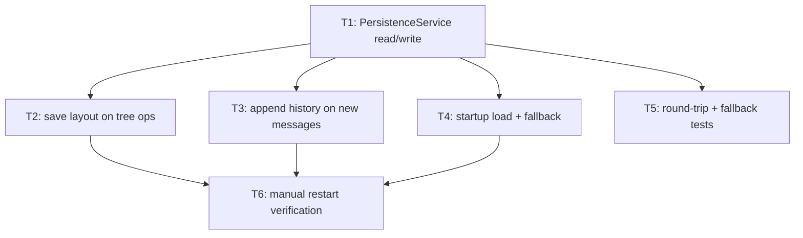

# Bullet 04 — Persistence & Restart Restore

**Goal:** Pane layout and every pane's conversation history are written to local JSON as they change and fully restored after an app restart, with zero data loss.

**Serves these PRD items:**

- US-8: "As a user, I want my pane layout and every pane's conversation history to persist across app restarts so that I can resume all my parallel work exactly where I left off."
- G-3: "100% of pane layouts and per-pane conversation histories are correctly restored after an app restart, with zero data loss across a restart."

## Tasks

- [ ] **T1** [AFK] Implement `PersistenceService`: read/write layout JSON and per-pane history JSON via `@effect/platform-node`'s `FileSystem`, encoded/decoded through the `Schema` types from Bullets 01–02 (§4.4) — serves: US-8 — depends: —
- [ ] **T2** [AFK] Wire `PaneTreeService`'s `split`/`close`/`resize` to call `PersistenceService.saveLayout` on every change (§4.1) — serves: US-8 — depends: T1
- [ ] **T3** [AFK] Wire `PaneSupervisor`'s message/history stream to append to that pane's history file on each new message (§4.2 step 3) — serves: US-8 — depends: T1
- [ ] **T4** [AFK] Implement startup load: read layout + history files on app launch, reconstruct the `PaneNode` tree and `PaneRecord`s, falling back to an empty default layout on `PersistenceReadError`/`PersistenceDecodeError` (§4.4, §6) — serves: US-8 — depends: T1
- [ ] **T5** [AFK] Automated tests: encode/decode round-trip for layout and history JSON, and malformed-file fallback to empty default layout — serves: US-8 — depends: T1
- [ ] **T6** [HIL] Manual verification: build a real multi-pane layout with active conversations, restart the app, confirm layout and every pane's history restore exactly with zero data loss — serves: US-8, G-3 — depends: T2, T3, T4

## Dependency tree

## Human-in-the-loop callouts

- **T6** — Confirming "zero data loss across a restart" for real, in-progress conversations requires a human to actually build a layout, restart the app, and compare — an assertion in a test cannot stand in for the actual restart cycle this goal describes (blocked-on-info: only observable by performing the restart).

## Done when

A layout with 6 active panes, each with real conversation history, survives an app restart with the exact same tree structure and every message intact in every pane.
