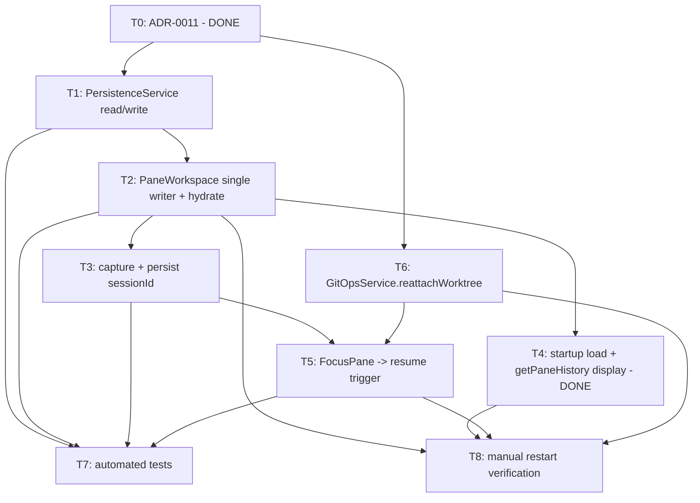

# Bullet 05 — Persistence & Restart Restore

**Goal:** Pane layout and every pane's conversation history survive an app restart with
zero data loss, and each pane can resume its live Claude session where it left off.

**Serves these PRD items:**

- US-10: "As a user, I want my pane layout and every pane's conversation history to persist across app restarts so that I can resume all my parallel work exactly where I left off."
- G-3: "100% of pane layouts and per-pane conversation histories are correctly restored after an app restart, with zero data loss across a restart."

---

## Aligned design (2026-07-16)

> **This bullet was re-scoped during a `get-aligned` session. The task list below
> replaces the original one** (preserved in git history). The re-scope is recorded in
> **[ADR-0011 — Delegate conversation-transcript persistence to the Agent SDK session
> store](../../../docs/adr/0011-delegate-transcript-persistence-to-agent-sdk-session-store.md)**,
> which supersedes ADR-0008.

**Key finding:** the Agent SDK already persists each pane's full transcript (prompts, tool
calls, results, responses — user *and* assistant messages) to
`~/.claude/projects/<encoded-cwd>/<session-id>.jsonl`, and exposes `resume`,
`listSessions()`, and `getSessionMessages()`. So dia does **not** hand-roll
conversation-history JSON.

Locked decisions (all confirmed with the user):

1. **dia persists one atomic file**, `workspace.json`, under `app.getPath('userData')`:
   ```
   { tree: PaneNode, panes: Record<PaneId, { config: PaneConfig, sessionId?: string }> }
   ```
   Single file so tree + index can't tear apart across two writes.
2. **Transcript is delegated to the SDK session store.** dia stores only the `sessionId`
   needed to resume.
3. **Restore is lazy, live, on focus.** On launch: rebuild the tree; render each pane's
   transcript via `getSessionMessages()` (no process spawn). On first focus of a cold
   pane: spawn its process with `resume: sessionId`.
4. **resize is out of scope** — it is not wired anywhere yet (no `ResizePane` command, no
   `PaneWorkspace.resize`, no gateway handler). Persist `split`/`close`/`create` only.

---

## Spike results — worktree reattach (git 2.47.1.windows.2, 2026-07-16)

Worktree panes are the hard case: the SDK keys sessions by `<encoded-cwd>`, so a pane's
`cwd` must be reconstructable at its exact original path for `resume` to find the
transcript. Worktree `cwd` is `<userData>/worktrees/<paneId>` (deterministic ✓), but
worktrees are removed on graceful shutdown while the branch `dia/<paneId>` persists.

- ❌ Current `GitOpsService.createWorktree` path `git worktree add <path> -b dia/<paneId>`
  **fails on resume**: `fatal: a branch named 'dia/pane-123' already exists`.
- ✅ **Reattach** `git worktree add <path> dia/<paneId>` (no `-b`) succeeds and restores
  the branch's committed work intact. **This is the resume incantation.**
- ⚠️ **Never use `-B`**: `git worktree add -B dia/<paneId> <path>` force-resets the branch
  to HEAD and **discards the pane's committed work**.
- ⚠️ Reattach must be **guarded**: re-adding when the worktree dir already exists fails, so
  resume must be a no-op when the pane already has a live handle. On an ungraceful crash
  the dir may survive but be unregistered — `git worktree prune` before reattach may be
  needed (untested; verify if crash-recovery becomes a requirement).

---

## Tasks

- [x] **T0** [AFK] Write ADR-0011 (delegate transcript to SDK session store; persist tree + pane index; resume lazily on focus), supersede ADR-0008, update the ADR index — depends: —
- [x] **T1** [AFK] Implement `PersistenceService` (`src/main/services/persistence.ts`): `saveWorkspace` (atomic temp-write + rename, typed `PersistenceWriteError`) / `loadWorkspace` (decode-tolerant → `Option`, catching `PersistenceReadError`/`PersistenceDecodeError` internally → `None` + log). New `PersistedWorkspace`/`PersistedPaneEntry` schema (`{ tree, panes: Record<PaneId, { config, sessionId? }> }`) in `persistence.ts`. Mirrors `SettingsStore`'s pattern. Tests: `persistence.test.ts` (round-trip incl. optional `sessionId`/`worktree`, atomic write order, absent/malformed/schema-mismatch/unreadable → `None`, write-failure → typed error). — serves: US-10 — depends: T0
- [x] **T2** [AFK] `PaneWorkspace` is now the **single writer** of `workspace.json`: `save()` after `split`/`createPane`/`close` (failures logged & swallowed). Self-hydrates on layer init from `PersistenceService.loadWorkspace` (restored tree kept cold, no spawn; falls back to the default pending leaf when absent/corrupt). `configsRef` now holds `PersistedPaneEntry` (`{ config, sessionId? }`) so T3 can attach `sessionId`. `PersistenceService` wired into the composition root. Tests: hydrate-without-spawn, save-on-create/split/close, sessionId survives a save cycle. — serves: US-10 — depends: T1
- [x] **T3** [AFK] Capture & persist `sessionId`: `agent-session.ts` reads `session_id` from the `system`/`init` SDK message and posts a new Outbound `SessionStarted { sessionId }`; `PaneSupervisor.openPane` takes an `onSessionId` callback and routes `SessionStarted` to it (no workspace↔supervisor cycle); `PaneWorkspace.recordSessionId` updates the index entry and re-saves. Tests: supervisor routes `SessionStarted`→callback; workspace records an async sessionId + re-saves. — serves: US-10 — depends: T1, T2
- [x] **T4** [AFK] Startup load + transcript display: `loadWorkspace` on launch → hydrate `PaneWorkspace` (tree + configs), falling back to the default pending leaf on absent/corrupt (done via T2 self-hydration). Added `TranscriptReader` service (`src/main/services/transcript-reader.ts`) wrapping SDK `getSessionMessages()` with a pure `sessionMessagesToConversation` projection (keeps user/assistant text turns, joins assistant text blocks, drops tool-only/undecodable turns, degrades to `[]` on a missing session). `PaneWorkspace.getPaneHistory(paneId)` returns `[]` for a pane with no recorded `sessionId`, else delegates to `TranscriptReader`. Added IPC `getPaneHistory` channel + `DiaApi.getPaneHistory` + preload bridge + gateway `wireGetPaneHistory`; renderer seeds each pane's messages query from it. Tests: mapping fixture (7 cases); workspace `getPaneHistory` empty-without-session + reads-by-restored-session. — serves: US-10 — depends: T2
- [ ] **T5** [AFK] Resume-on-focus trigger: add `FocusPane` to the `IpcCommand` union + `DiaApi` + preload + gateway handler; wire renderer `onFocusPane` (in `app.tsx`). Cold pane + focus → `PaneWorkspace.resumePane` → recreate worktree if needed (T6) → `openPane` with `resume: sessionId` threaded through `Init` → `query({ resume })`. Idempotent (no-op) when the pane already has a live handle — serves: US-10 — depends: T3, T6
- [ ] **T6** [AFK] Worktree reattach: add `GitOpsService.reattachWorktree` using `git worktree add <path> dia/<paneId>` (no `-b`, never `-B`), guarded against an already-live pane. See spike results above — serves: US-10 — depends: T0
- [ ] **T7** [AFK] Automated tests: `PersistenceService` round-trip (tree + index + `sessionId`), atomic write, malformed/absent → default fallback; `PaneWorkspace` save-on-op + hydrate + `sessionId` record; gateway `FocusPane`→resume with fakes; `getSessionMessages`→`ConversationMessage` mapping fixture. (Transcript zero-loss is no longer a dia unit test — the SDK owns it; covered by T8) — serves: US-10 — depends: T1, T2, T3, T5
- [ ] **T8** [HIL] Manual verification: build a real multi-pane layout with active conversations, restart the app, confirm layout and every pane's history restore exactly with zero data loss, and each pane resumes live context on focus — serves: US-10, G-3 — depends: T2, T4, T5, T6

## Dependency tree



## Human-in-the-loop callouts

- **T8** — Confirming "zero data loss across a restart" and live resume for real, in-progress
  conversations requires a human to actually build a layout, restart the app, focus each
  pane, and compare — an assertion in a test cannot stand in for the actual restart cycle
  this goal describes (blocked-on-info: only observable by performing the restart).

## Done when

A layout with 6 active panes, each with real conversation history, survives an app restart
with the exact same tree structure and every message intact in every pane, and focusing a
restored pane resumes its live Claude session with prior context.

---

## Resume context (for a future session)

**Status at end of 2026-07-16 session:** design aligned, ADR-0011 written & accepted, spike
done. **No implementation code written yet.** Next actionable task: **T1**.

**Status 2026-07-17 session:** open decisions resolved (see "Resolved during alignment"
above). **T1 DONE & verified** (`persistence.ts` + `persistence.test.ts`, full suite 76/76
green, typecheck + lint clean; not yet committed). Next actionable task: **T2** (make
`PaneWorkspace` the single writer of `workspace.json` + add a hydrate path).

**Files read/understood during scoping (the map for implementation):**

- `src/main/domain/pane.ts` — `PaneConfig` (`paneId, cwd, model, worktree?`), `PaneRecord`
  (`config, history, attention`), `ConversationMessage` (`role, content`). Reuse `PaneConfig`
  in the pane index; the new `PersistedWorkspace` schema lives here or in `persistence.ts`.
- `src/main/domain/pane-tree.ts` — `PaneNode` union + `PaneNode` schema (already
  encode/decodable). `resizeSplit` exists as a pure fn but is unused/unwired (out of scope).
- `src/main/services/settings-store.ts` — **the pattern to mirror** for `PersistenceService`
  (Layer.effect + `FileSystem`, JSON under `userData`, decode-tolerant read). Note: it
  swallows errors; T1 should use typed `PersistenceReadError`/`PersistenceDecodeError`.
- `src/main/services/pane-workspace.ts` — owns `treeRef` + `configsRef`. Becomes the single
  writer (T2). `makePaneWorkspaceLive(initialPaneId, worktreesRoot)` currently hardcodes the
  seed leaf — add a hydrate path. Add `resumePane` (T5).
- `src/main/services/pane-supervisor.ts` — owns per-pane `recordRef` (in-memory history,
  **assistant-only** today — now irrelevant since SDK owns transcript). `openPane` takes
  `PaneCreationRequest { paneId, sourceCwd, model, worktreePath }` + `onEvent`. Thread a
  `resume?: string` and a `onSessionId` callback through here (T3/T5). Worktree acquired via
  `acquireRelease` (removed on teardown/shutdown).
- `src/main/services/git-ops-service.ts` — `createWorktree` uses `-b` (breaks resume). Add
  `reattachWorktree` (T6). `GitOpsService` is intentionally general (see memory:
  git-ops-service-naming).
- `src/main/pane-process/agent-session.ts` — `query({ prompt, options: { cwd, model,
  includePartialMessages, canUseTool } })`. **Does NOT capture `session_id`** and **does NOT
  pass `resume`.** T3 adds init-message `session_id` capture; T5 adds `resume` to options.
- `src/main/pane-process/protocol.ts` — `InboundMessage` (`Init`/`SendText`/`ResolvePermission`)
  and `OutboundMessage`. Add `SessionStarted { sessionId }` to Outbound; add `resume?` to `Init`.
- `src/main/ipc/contract.ts` — `IpcCommand` union (add `FocusPane`), `DiaApi` interface (add
  `focusPane` + `getPaneHistory`), `CHANNEL` (add a `getPaneHistory` channel). Comment already
  anticipates `FocusPane` joining the union.
- `src/main/ipc/gateway.ts` — `wireCommands` dispatch (add `FocusPane` case → `resumePane`);
  `wireGetInitialLayout` (now returns the restored tree); add a `getPaneHistory` handler.
- `src/main/index.ts` — composition root. Add `PersistenceService` layer (`NodeContext`/
  `NodeFileSystem` like `SettingsStore`), call `loadWorkspace` before wiring, seed workspace.
- `src/renderer/src/app.tsx` — `focusedPaneId` is **renderer-only** local state (never
  crosses IPC today). Wire `onFocusPane` → `window.dia.focusPane(paneId)` (T5). Renderer needs
  to call `getPaneHistory` for restored panes (T4).

**SDK docs (consult via `docs/llms/agent-sdk.txt` first):**
- Sessions: `resume: sessionId` on `query()`; capture `session_id` from the `system`/`init`
  `SystemMessage` (available early) or the result message. `continue: true` resumes most-recent
  in cwd (not used — we track ids explicitly for multi-pane).
- Session storage: transcripts at `~/.claude/projects/<encoded-cwd>/<session-id>.jsonl`
  (`<encoded-cwd>` = abs cwd with every non-alphanumeric → `-`); `CLAUDE_CONFIG_DIR` overrides
  the root. `getSessionMessages()` returns the post-compaction chain. `cleanupPeriodDays`
  sweeps old sessions — handle a missing session file on resume/display as a fallback.

**Resolved during alignment (2026-07-17):**
1. **`getSessionMessages` availability — RESOLVED.** Verified against the SDK docs
   (`sessions.md` + TS reference): `listSessions()` and `getSessionMessages()` are real
   TypeScript SDK exports for reading past sessions off disk without a `query()` spawn, so
   T4's "render restored transcript without spawning" approach holds. Exact return shape is
   an implementation detail to pin down while coding T4 (map text blocks → `ConversationMessage`,
   skipping tool-only/tool-result turns, mirroring `agent-session.ts`'s non-empty-text emit).
2. **Crash-recovery worktree state — DEFERRED.** T6 implements only the guarded,
   graceful-shutdown reattach (`git worktree add <path> dia/<paneId>`, no `-b`, never `-B`,
   no-op when a live handle exists). Crash-orphaned (dir-present-but-unregistered) worktrees
   are **out of scope for this bullet** — logged with a clear message pointing at a future
   crash-recovery bullet. No `git worktree prune`-before-reattach here.
3. **Swept transcript — RESOLVED (degrade to a usable pane).** No special detection needed:
   the SDK silently returns a *fresh* session when the transcript file is missing (per the
   sessions-doc Tip), so resume-on-focus just starts fresh; T3's `session_id` capture
   re-persists the new id. Empty restored history is the only visible effect; `getPaneHistory`
   returns empty for a missing session rather than throwing.
4. **Deleted non-worktree cwd — RESOLVED (degrade to a usable pane).** `resumePane` checks
   `fs.exists(cwd)` up front and, if the dir is gone, fails fast to the pane's existing
   `Errored` attention state (reuse `markErrored`/`PaneError`) rather than surfacing a cryptic
   SDK spawn error. **No new domain type or leaf status is needed** — a cold restored pane is
   `ready` in the tree with no live handle in `PaneSupervisor`, which is exactly what
   `resumePane` keys off.

**Assumptions carried into implementation (2026-07-17):**
- Save failures in `PaneWorkspace` after `split`/`close`/`create` are logged and swallowed
  (mirroring `SettingsStore.write`); the op already succeeded in memory and the next op retries
  the write. No UI surfacing of write failures in this bullet.
- Saves are synchronous after each layout op (split/close/create are infrequent — no debouncing).
- Closing a pane does not delete its SDK transcript; the SDK owns retention, dia only drops the
  pane from its own index.

**Recommended follow-up not yet done:** add a `docs/reasoning/` entry capturing the two
non-obvious findings (SDK owns the transcript; `git worktree` `-b`/bare/`-B` semantics incl.
`-B` data loss) — both would trip up a future session.

**Bullet 09 (Pending-request persistence)** builds directly on this substrate; its T1 SDK
`defer`/resume spike is now partly informed by ADR-0011 and the findings above.
