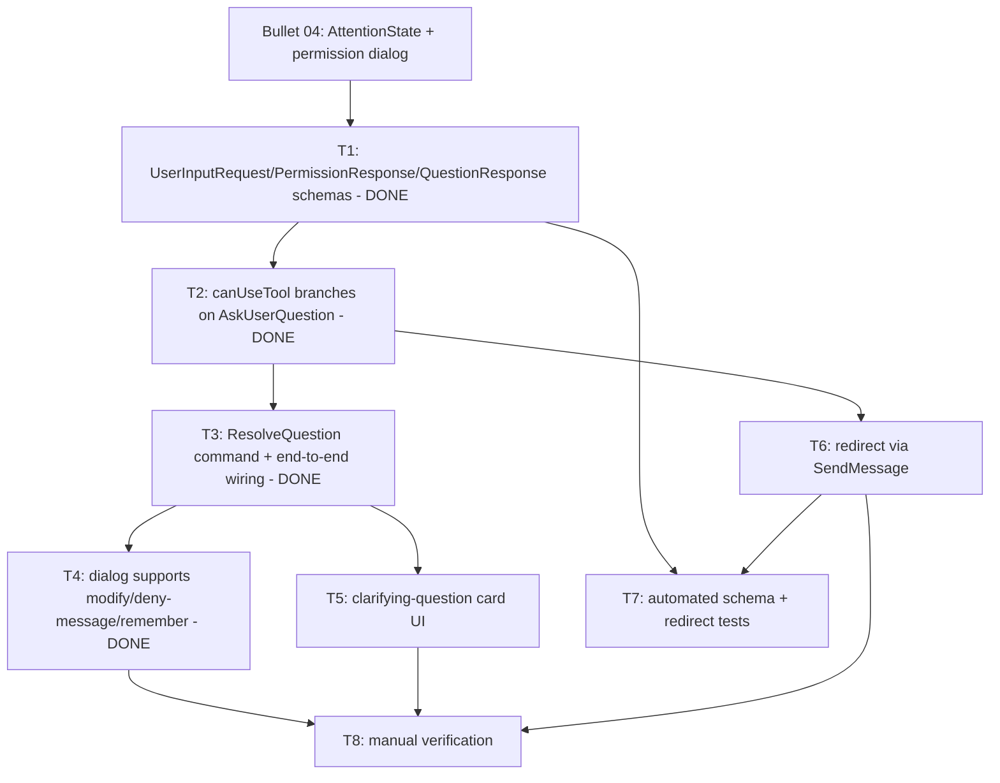

# Bullet 06 — Richer Permission Responses & Clarifying Questions

**Goal:** A pane's permission dialog stops being a binary allow/deny — the user can edit a tool's input before approving, mark a kind of call "always allow", deny with an explanation, or redirect Claude entirely with a new instruction — and a parallel clarifying-question flow lets Claude ask multiple-choice questions (with free text) through the same `canUseTool` path.

**Serves these PRD items:**

- US-11: "As a user, I want to answer Claude's multiple-choice clarifying questions, including typing my own answer when none of the options fit, directly from the pane so that I can guide a task with multiple valid approaches without it being treated as a tool permission prompt."
- US-12: "As a user, I want to edit a tool's proposed parameters before approving it so that I can allow an action scoped exactly the way I want instead of denying it outright."
- US-13: "As a user, I want to mark 'always allow' for a specific kind of tool call from the permission dialog so that I stop being re-prompted for that same category of action in that pane going forward."
- US-14: "As a user, I want to deny a tool request with an explanation of what I'd prefer instead so that Claude adjusts its next attempt rather than repeating the same blocked action."
- US-15: "As a user, I want to send Claude a brand new instruction while a permission or question prompt is pending so that I can redirect it entirely instead of only being able to respond to the current request."
- G-6: "Every clarifying question Claude asks (via `AskUserQuestion`), including free-text answers, is answerable from the pane UI with zero malformed or dropped answers observed during testing."
- G-7: "All four permission-response types (allow as-is, allow with modified input, deny with a message, allow-and-remember) are each exercised at least once during manual testing and correctly change the tool's execution or Claude's next action, with zero incorrect behavior observed."

## Tasks

- [x] **T1** [AFK] Generalize `AwaitingPermission`'s payload into the `UserInputRequest` `Schema` union (`PermissionRequest` | `ClarifyingQuestion`), and add `PermissionResponse` (`Allow`/`Deny`) and `QuestionResponse` (`Answers`/`FreeformResponse`) `Schema`s (§3) — serves: US-11, US-12, US-13, US-14 — depends: (Bullet04/T1)
  - Added to `domain/attention.ts`: `PermissionUpdate` (opaque SDK pass-through), `Question`, a tagged `PermissionRequest` (now carries `suggestions`), `ClarifyingQuestion`, `UserInputRequest = Union(PermissionRequest, ClarifyingQuestion)`, `PermissionResponse` (`Allow` with `updatedInput`/optional `updatedPermissions` | `Deny` with `message`), and `QuestionResponse` (`Answers` with per-question `answers: Record<string, string | string[]>` | `FreeformResponse`), both echoing the `questions` they answer. `AwaitingPermission.request` is now `UserInputRequest`. Both request variants carry `requestId` for correlation (a deliberate addition over §3's simplified shape). Ripple fixes to keep the build green: `pane-supervisor.ts` and `attention.test.ts` now stamp `_tag: 'PermissionRequest'` on the constructed request; `pane.tsx`'s `pendingPermission` query retyped to `PanePermissionRequested` (the event it actually holds). Kept the domain's `TaggedStruct` style over the guide's `Class` preference for codebase consistency.
- [x] **T2** [AFK] Extend `AgentSession`'s `canUseTool` to branch on `toolName === "AskUserQuestion"`, emitting a `ClarifyingQuestion` request instead of a `PermissionRequest`, and to pass through `suggestions`/`updatedPermissions` for an "always allow" rule (§4.3) — serves: US-11, US-13 — depends: T1
  - `agent-session.ts`: `canUseTool` decodes `input.questions` (safe `Either` decode per the decode-at-boundary rule) and posts `QuestionRequested` when it matches the `Question` schema, else `PermissionRequested` (now carrying the SDK's `suggestions`); a malformed `AskUserQuestion` input degrades to a permission request with a warning. One `pendingRequests` map holds `Deferred<PermissionResponse | QuestionResponse>` (disjoint tags). Two isolated mappers: `toPermissionResult` (Deny→deny; Allow→allow, forwarding `updatedInput` only when edited and echoing the **retained SDK `options.suggestions`** as `updatedPermissions` when the response asks to remember — avoids passing opaque IPC objects back to the SDK, so no casts) and `questionResponseToResult` (the T8-verification point: shapes `updatedInput` like the SDK's `AskUserQuestionOutput`, comma-joining multi-select answers).
  - Amended T1: `PermissionResponse.Allow.updatedInput` is now optional (absent = allow-as-is).
  - `protocol.ts`: `ResolvePermission` now carries a `PermissionResponse`; added `ResolveQuestion` (carries `QuestionResponse`) and outbound `QuestionRequested`; `PermissionRequested` gained optional `suggestions`.
  - `pane-supervisor.ts`: `PaneHandle.resolvePermission(requestId, PermissionResponse)` + new `resolveQuestion(requestId, QuestionResponse)`; `QuestionRequested` drives an `AwaitingPermission`/`ClarifyingQuestion` attention (amber) with no renderer event yet (card is T5).
  - `gateway.ts`: transitional shim translating the still-unchanged contract `ResolvePermission {decision, message}` into a `PermissionResponse`, keeping `contract.ts`/preload/renderer untouched this task (removed in T3).
- [x] **T3** [AFK] Add the `ResolveQuestion` IPC command and route `PermissionResponse`/`QuestionResponse` end-to-end through `contract.ts`, `protocol.ts`, and the preload bridge — serves: US-11, US-12, US-13, US-14 — depends: T1, T2
  - `contract.ts`: `ResolvePermission` now carries a `PermissionResponse` (dropped `decision`/`message`); added `ResolveQuestion` command (`QuestionResponse`) to the `IpcCommand` union; `PanePermissionRequested` gained optional `suggestions`; added `PaneQuestionRequested` event to the `IpcEvent` union; `DiaApi` gained `resolveQuestion` + `onQuestionRequested` and `resolvePermission`'s signature changed to take a `PermissionResponse`.
  - `gateway.ts`: removed the T2 shim — `ResolvePermission` now forwards `command.response` straight through; added a `ResolveQuestion` case mirroring the same getHandle/Option/catchAllCause pattern.
  - `pane-supervisor.ts` `toIpcEvent`: `QuestionRequested` now emits `PaneQuestionRequested`; `PermissionRequested` threads `suggestions` through when present.
  - `preload/index.ts`: `resolvePermission` sends `response`; added `resolveQuestion` (with `encodeResolveQuestion`) and `onQuestionRequested` subscriber.
  - `pane.tsx`: `respondToPermission` builds a `PermissionResponse` (`allow` → `{_tag:'Allow'}`, `deny` → `{_tag:'Deny', message}`) — behavior-preserving plumbing; the rich dialog is T4.
- [x] **T4** [AFK] Renderer: extend the permission dialog with an editable input field before allowing, a required message field when denying, and an "always allow this kind of call" toggle that echoes a `suggestions` entry back as `updatedPermissions` — serves: US-12, US-13, US-14 — depends: T3
  - New `permission-dialog.tsx` (`PermissionDialog`): structured per-field editor over the tool's top-level input — primitives as `Input`/`Switch`, nested objects/arrays as a JSON `Textarea` (per the user's "top-level fields, JSON for nested" decision). Pure `reconstructInput` helper merges edits over the original and reports `changed` (so `updatedInput` is sent only when the user actually edited) and per-field validity (bad number / unparseable JSON disables Allow and marks the field `aria-invalid`). A "Note to Claude" textarea gates Deny (required, non-empty); dismissal (Esc / overlay) denies with a default note. An "always allow {tool} in this pane" `Switch` appears only when the request carries `suggestions`, echoing them back as `updatedPermissions`.
  - Added shadcn `textarea`/`input`/`label` via the CLI; reused existing `switch`. Styled with semantic tokens (`bg-muted`, `text-foreground`, `text-muted-foreground`, `text-destructive`) and mono for tool data per DESIGN.md's Content-Is-Mono Rule.
  - `pane.tsx`: `respondToPermission` now takes a `PermissionResponse` and the inline dialog is replaced by `<PermissionDialog>`. Deleted the now-superseded `permission-input-preview.tsx` (its only consumer). Visual/behavioral confirmation against a real session is T8.
- [ ] **T5** [AFK] Renderer: new clarifying-question card — render `questions[]` as radio groups (or checkboxes when `multiSelect`) plus an "Other" free-text option per question, and submit via `ResolveQuestion` — serves: US-11 — depends: T3
- [ ] **T6** [AFK] Wire the pane's existing `SendMessage` path so sending a message while a `UserInputRequest` is pending forwards a new instruction to the SDK's streaming input and leaves the pending `Deferred` to be dropped once the SDK moves on (§4.3) — serves: US-15 — depends: T2
- [ ] **T7** [AFK] Automated tests: `PermissionResponse`/`QuestionResponse` `Schema` encode/decode round trips (including `multiSelect` arrays and free text in place of a label), and a test confirming a redirect leaves the pending `Deferred` unresolved rather than double-resolving it — serves: G-6, G-7 — depends: T1, T6
- [ ] **T8** [HIL] Manual verification against a real session: exercise each `PermissionResponse` variant (allow, allow with modified input, deny with message, allow-and-remember) and confirm each changes Claude's behavior as documented; answer a real `AskUserQuestion` prompt including free text and a `multiSelect` question; redirect a pane mid-prompt with a new instruction and confirm Claude follows it instead of the original request — serves: US-11, US-12, US-13, US-14, US-15, G-6, G-7 — depends: T4, T5, T6

## Dependency tree

## Human-in-the-loop callouts

- **T8** — Whether each permission-response variant and the clarifying-question/redirect flows actually behave as documented against a real Agent SDK session (correct tool execution, correct Claude-side adjustment, correct redirect takeover) can only be judged by observing a real session; this is blocked-on-info (the SDK's real behavior isn't fully knowable until exercised) and is exactly what G-6/G-7 require to be demonstrated by a human, not asserted.

## Done when

Across a real session, a user can allow a tool call as-is, allow it with edited input, deny it with an explanation Claude visibly adjusts to, and mark a kind of call "always allow" so it stops re-prompting; a real `AskUserQuestion` call is answerable including free text and multi-select; and sending a new message while a request is pending redirects Claude instead of just resolving the original request.
