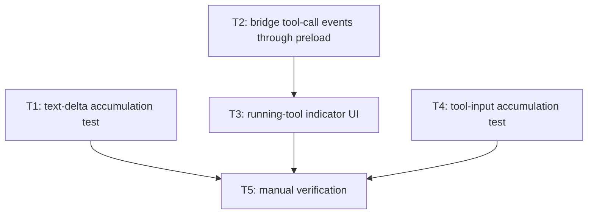

# Bullet 07 — Streaming Text & Tool-Call Activity

**Goal:** Assistant text appears in a pane incrementally as it's generated, and the tool currently running (if any) is visible — closing the gap between what `agent-session.ts` already emits and what the renderer actually shows.

**Serves these PRD items:**

- US-17: "As a user, I want to see an agent's response appear incrementally as it's generated so that I can start reading before it finishes, rather than waiting on a blank pane."
- US-18: "As a user, I want to see which tool a pane's agent is currently running so that I understand what's happening while I wait, instead of a pane looking idle mid-task."
- G-9: "Assistant responses appear in a pane incrementally as they're generated, and the tool currently running (if any) is visible, with no dropped, out-of-order, or batched-until-the-end chunks observed during testing."

## Tasks

- [ ] **T1** [AFK] Automated test: `AssistantTextDelta` chunks accumulate to the same complete text a non-streamed `AssistantMessage` would produce, in arrival order — serves: US-17, G-9 — depends: —
- [ ] **T2** [AFK] Bridge `PaneToolCallStarted`/`PaneToolCallCompleted` through the preload `contextBridge` as `onToolCallStarted`/`onToolCallCompleted` (these already reach `contract.ts` but stop there) — serves: US-18 — depends: —
- [ ] **T3** [AFK] Renderer: track the current tool name per pane from `onToolCallStarted` until its matching `onToolCallCompleted`, and render a status indicator (e.g. "Using Read…") near the pane header — serves: US-18 — depends: T2
- [ ] **T4** [AFK] Automated test: `input_json_delta` chunks for a tool call accumulate into valid, correctly-parsed tool input across multiple chunks, matching `ToolCallCompleted.input` — serves: G-9 — depends: —
- [ ] **T5** [HIL] Manual verification against a real session: confirm assistant text visibly streams rather than appearing all at once, and the running-tool indicator appears and clears correctly across a turn with multiple sequential tool calls — serves: US-17, US-18, G-9 — depends: T1, T3, T4

## Dependency tree

## Note on existing plumbing

Text streaming is already fully wired end-to-end: `agent-session.ts` sets `includePartialMessages: true` and maps `content_block_delta`/`text_delta` events to `AssistantTextDelta`, which already reaches the renderer's streaming-text display via `onAssistantTextDelta`. T1 adds test coverage for behavior that already exists rather than building it.

Tool-call streaming is implemented in `agent-session.ts` (`ToolCallStarted`/`ToolCallCompleted`, including `input_json_delta` accumulation) and already defined in `contract.ts` as `PaneToolCallStarted`/`PaneToolCallCompleted`, but the preload bridge never exposes them and no renderer component consumes them — T2/T3 are the only gap.

## Done when

In a real session, assistant text visibly streams into the pane token-by-token rather than appearing as one block, and a status indicator shows which tool is currently running, correctly appearing and clearing across multiple tool calls within one turn.
