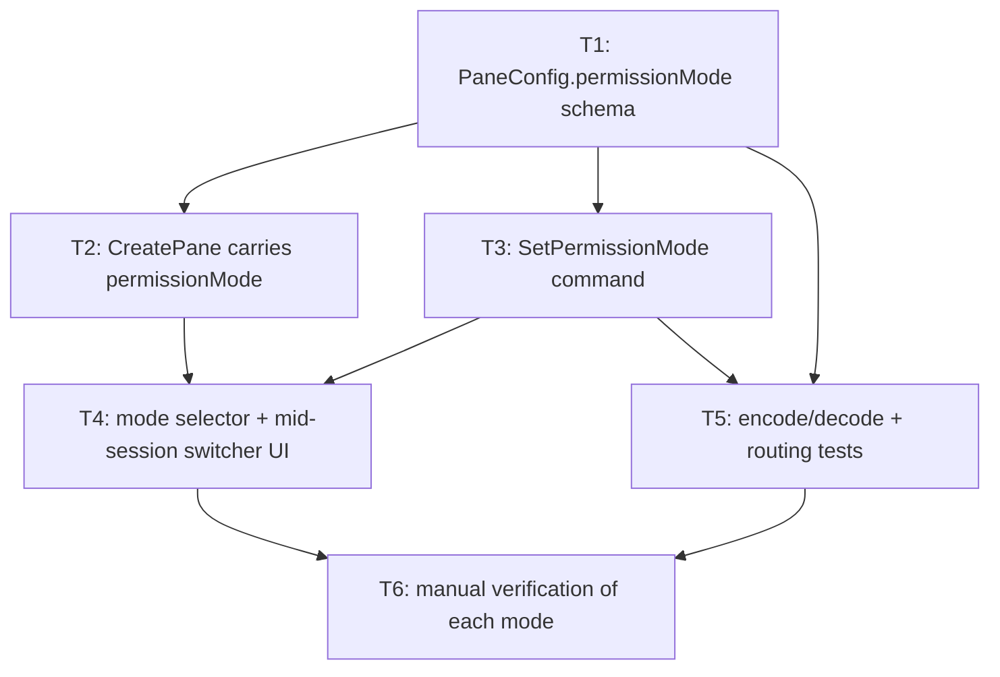

# Bullet 08 — Permission Mode Selection

**Goal:** A pane's permission mode (`default` / `plan` / `acceptEdits` / `auto` / `dontAsk`) is chosen at pane creation and can be changed while the pane is running, without closing and recreating it. `plan` is not offered at creation (a pane always starts in a non-plan mode); it is only reachable via the mid-session switcher, and approving a plan restores the mode the pane held before switching into `plan`.

**Serves these PRD items:**

- US-19: "As a user, I want to choose a pane's permission mode (e.g. always ask, auto-accept edits, auto-approve via classifier, don't ask) when I create it so that I can set how much autonomy that pane's agent starts with."
- US-20: "As a user, I want to change a pane's permission mode while it's running so that I can loosen or tighten its autonomy as I build trust in what it's doing, without closing and recreating the pane."
- G-10: "Every supported permission mode (default, plan, accept-edits, auto, don't-ask) is selectable at pane creation (except `plan`, which is mid-session only) and changeable mid-session, and each produces the tool-approval behavior documented for that mode, with zero incorrect approvals or denials observed during testing."

## Tasks

- [x] **T1** [AFK] Add `permissionMode: PermissionMode` to the `PaneConfig` `Schema` (§3), defaulting to `"default"` — serves: US-19 — depends: —
- [x] **T2** [AFK] Extend the `CreatePane` IPC command with `permissionMode`; `PaneSupervisor` passes it into `AgentSession`'s `query()` options at session start (§4.2 step 2, §4.3) — serves: US-19 — depends: T1
- [x] **T3** [AFK] Add the `SetPermissionMode` IPC command; `AgentSession` calls the SDK's `setPermissionMode()` on the live session and updates the pane's stored `PaneConfig.permissionMode` so later reads/persistence reflect the current mode (§4.3). Switching into `plan` records the prior mode; on `ExitPlanMode` approval the pane is restored to that mode (on reject it stays in `plan`) — serves: US-20 — depends: T1
- [x] **T4** [AFK] Renderer: a permission-mode selector in the pane-creation form (offering every mode except `plan`, defaulting to `auto`), and a mid-session mode switcher (offering all five) in the pane composer for an already-running pane — serves: US-19, US-20 — depends: T2, T3
- [x] **T5** [AFK] Automated tests: `PaneConfig.permissionMode` encode/decode round trip, `SetPermissionMode` routes to the correct pane's process (not a sibling pane's), and approving a plan restores the pre-plan mode on the live session — serves: G-10 — depends: T1, T3
- [x] **T6** [HIL] Manual verification against real sessions: create a pane in each creation-eligible mode and confirm the documented approval behavior for each (e.g. `acceptEdits` auto-approves a file write that `default` would prompt for; `auto` lets the classifier decide; `dontAsk` denies instead of prompting); switch a running pane's mode and confirm the next matching tool call reflects the new mode, not the one it started with; switch a running pane to `plan`, approve the produced plan, and confirm it resumes in its pre-plan mode — serves: US-19, US-20, G-10 — depends: T4, T5

## Dependency tree

## Human-in-the-loop callouts

- **T6** — Whether each permission mode actually produces the documented approval behavior against a real Agent SDK session, and whether a mid-session mode change takes effect immediately, can only be judged by observing real tool calls under each mode; this is blocked-on-info (the SDK's real behavior isn't fully knowable until exercised) and is exactly what G-10 requires to be demonstrated by a human, not asserted. In particular, how `auto`'s classifier interacts with dia's `canUseTool` callback (it may approve/deny before the callback fires) and `dontAsk`'s deny-if-not-preapproved behavior are real-session discoveries.

## Done when

A pane can be created in any creation-eligible permission mode (`default`, `acceptEdits`, `auto`, `dontAsk`) and behaves as documented for that mode against a real session; switching a running pane's mode changes its next tool-approval decision accordingly; and switching to `plan`, then approving the produced plan, resumes the pane in its pre-plan mode — with no incorrect approval or denial observed.
