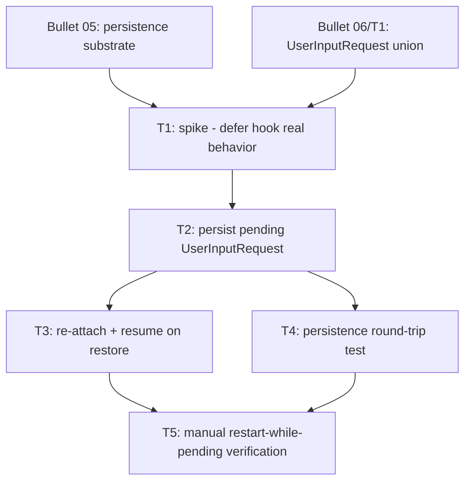

# Bullet 09 — Pending-Request Persistence Across Restart

**Goal:** A permission or clarifying-question prompt left unanswered when dia is closed is still present and answerable after dia is reopened, instead of being silently lost.

**Serves these PRD items:**

- US-16: "As a user, I want a permission or clarifying-question prompt that's still pending when I close dia to still be there when I reopen it, so an interrupted response doesn't lose Claude's request."
- G-8: "A permission or clarifying-question prompt left unanswered when dia is closed is still present and answerable after dia is reopened, verified across at least 3 manual restart-while-pending test runs with zero lost requests."

## Tasks

- [ ] **T1** [HIL] Spike: exercise the Agent SDK's `defer` hook decision against a real local session to determine the actual persisted-state shape it produces and how a session resumes a deferred `canUseTool` call after the process restarts — this is the open question the tech spec (§9) explicitly flags as unresolved — serves: G-8 (research feeds T2/T3's design) — depends: (Bullet05: persistence; Bullet06/T1: `UserInputRequest` union)
- [ ] **T2** [AFK] Based on the spike's findings, persist the pending `UserInputRequest` alongside the pane's `PaneRecord` in `PersistenceService`, encoded/decoded via its `Schema` — serves: US-16 — depends: T1
- [ ] **T3** [AFK] On pane restore, re-attach a persisted `UserInputRequest` to the pane's `AttentionState` and re-issue the SDK's defer/resume call so the session can act on it once the user responds — serves: US-16 — depends: T2
- [ ] **T4** [AFK] Automated test: persistence encode/decode round-trip for a `PaneRecord` with a pending `UserInputRequest`, including the existing malformed-file fallback path — serves: G-8 — depends: T2
- [ ] **T5** [HIL] Manual verification: leave a real permission prompt and a real clarifying-question prompt pending, quit and relaunch dia, and confirm each is still present and answerable — repeated across at least 3 runs per G-8 — serves: US-16, G-8 — depends: T3, T4

## Dependency tree

## Human-in-the-loop callouts

- **T1** — The SDK's `defer` hook decision's exact persisted-state shape and resume mechanics are not documented beyond "the process can exit and resume later from the persisted session"; this is blocked-on-info (it doesn't yet exist as a known fact — it has to be observed against a real session before T2/T3 can be designed correctly) and cannot be delegated to an agent without that direct observation.
- **T5** — Whether a pending prompt actually survives a real quit/relaunch cycle with zero loss can only be judged by performing that restart against a real session; this is blocked-on-info and is exactly what G-8 requires to be demonstrated by a human, not asserted.

## Done when

A permission or clarifying-question prompt left pending when dia is quit is still present, correctly attributed to its pane, and answerable after dia is relaunched — verified with zero lost requests across at least 3 restart-while-pending runs.
