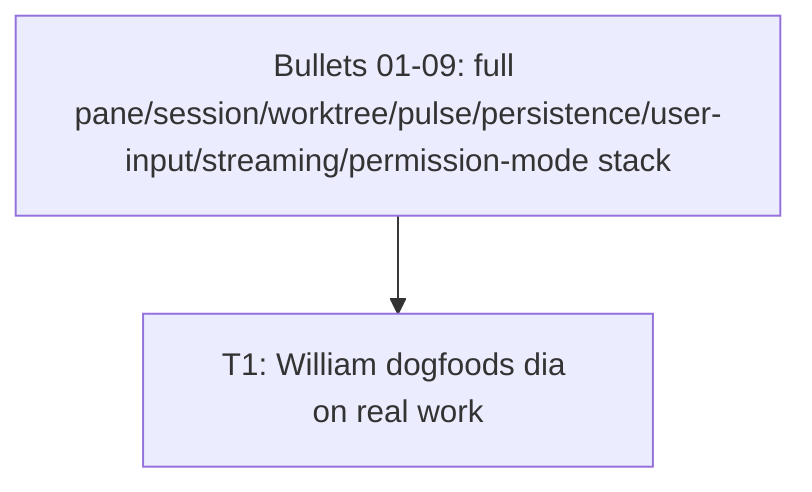

# Bullet 10 — Dogfooding Milestone

**Goal:** William replaces his prior single-session workflow with dia itself, running multiple parallel panes to carry out real development work on dia's own codebase — the actual outcome G-1 defines, not a further build increment.

**Serves these PRD items:**

- G-1: "Dogfooding milestone reached: William uses dia itself, running multiple parallel panes, to carry out real development work on dia's own codebase — replacing his prior single-session workflow for this purpose."

## Tasks

- [ ] **T1** [HIL] William uses dia — with multiple parallel panes, including at least one pane on dia's own repository — to do real development work, replacing his prior single-session workflow for this purpose — serves: G-1 — depends: (all of Bullets 01–09)

## Dependency tree

## Human-in-the-loop callouts

- **T1** — This is a real-world action only William can perform (irreducible: real-world action/credential — his own workflow, his own machine, his own judgment of whether it replaced the prior process); it is the literal content of G-1, not a task an agent can complete on his behalf.

## Done when

William has used dia, with multiple parallel panes, to complete real development work on dia's own repository, and confirms it replaced his prior single-session Claude Code workflow for that purpose.
